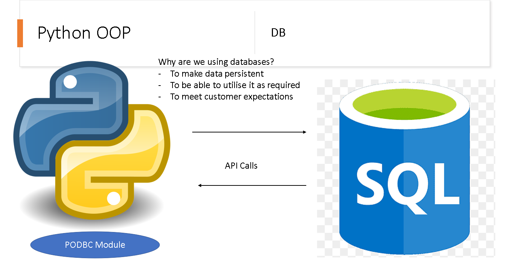

 # Python with SQL
 
 ## Using PYODBC (Open Database Connectivity) to connect to SQLfrom our python program
 ### Use Case:
 Using ODBC, an application developer can develop, compile, and ship an application without targeting a specific DBMS. In this scenario, the application developer does not need to use embedded SQL; thereby eliminating the need to recompile the application for each new environment.

 ## What is a cursor and how to use it 
 # Some functions we can use to interact with SQL data:
- install the necessary drivers
- Set up PYODBC connection
- In terminal use the command `pip install pyodbc` to install the module 


## How to Use SQL in Python:
1. Establish connection with your DB:
```python
# pyodbc driver from microsoft helps us to connect to SQL instance
# we will connect to ourr Northwind DB which we have already used in the SQL week
import pyodbc

server = "databases1.spartaglobal.academy"
database = "Northwind"
username = "SA"
password = ""
connection = pyodbc.connect(
    f"DRIVER=ODBC Driver 17 for SQL Server;SERVER={server};DATABASE={database};UID={username};PWD={password}"
)

# server namme - server name - username - and password is required to connect to pyodbc 
```

2. Cursor is the location of our connection:
```python
cursor = connection.cursor()
# lets us know where the cursor is 

# cursor.execute('SELECT @@VERSION')
# # select the version of the current DB
# row = cursor.fetchone()
# print(row)
```

3. Run a query in our customer table: 

```python
product_rows = cursor.execute('SELECT * FROM Products')
# getting through table 
# iterating the data until the last line of the data (until condition is false)
while True:
    records = product_rows.fetchone()
    # when there is no records left it means the value is none
    if records is None:
        # means stop 
        break 
    print(records.UnitPrice)
```

# Summary 
- pyodbc installation and connection setup 
- cursor utilisation
- fetchone() selects each record
- fetchall() selects all records 


# Task 
- Create a new file and class with functions to establish conection with pyodbc
- create a function that creates a table in the DB
- create a function that prompts the user to input data in that table. 
- create a new file called PYODBC_TASK.md and document the steps to implement the task
